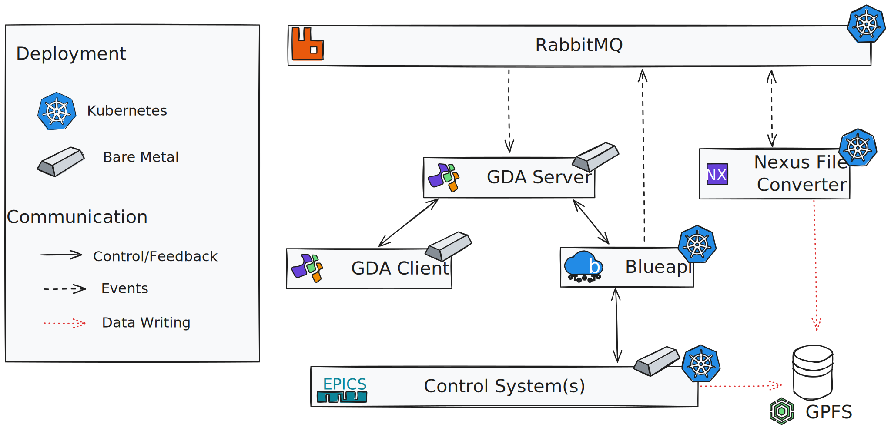
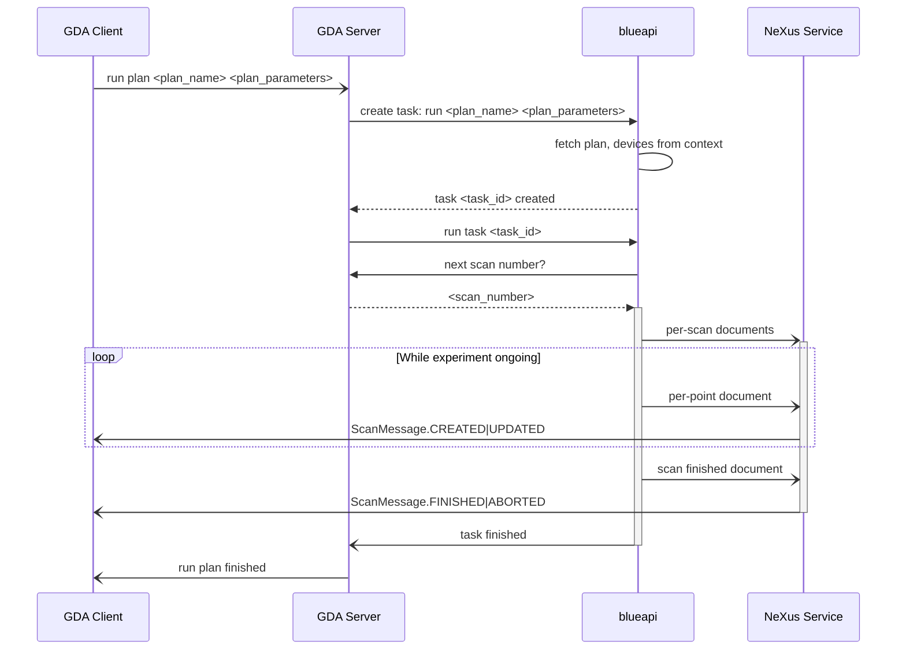

# Architecture

!!! info "Disclaimer"

    The Athena architecture is currently evolving and this document reflects its current state. Changes, including breaking changes, are likely for the foreseeable future!

## Design Principles

### Service Architecture

Athena uses a service-based architecture which encapsulates units of functionality into discrete "services". This is in contrast with a monolithic architecture in which a single application contains all the components. Services have their own runtime and are not part of a larger framework. [Active Athena services are defined in the dev-portal](https://dev-portal.diamond.ac.uk/catalog/default/system/athena).

For over 15 years, data acquisition at Diamond has been controlled via GDA, a large monolithic Java application. The hope is that a service architecture will split the functionality of GDA into many functional blocks that "do one thing and do it well". The hope is that these are easier to update, maintain and test. They can make use of modern technologies and development practices which should enable easier maintenance, better reliability and greater staff retention which in turn translates to more development effort and ultimately enables more science.

Athena services are designed according to [the Services design policy](../../policies/services.md).

### Avoid Bespoke Solutions

Historically Diamond has rolled bespoke solutions where off-the-self packages that do _nearly_ the same thing are available. The Athena platform deliberately emphasizes a preference for the off-the-self solutions wherever possible and minimization of bespoke code, which frees up developer time to write specialist solutions to problems unique to scientific facilities. The adoption of commonly used technologies also aids in maintenance, staff-onboarding and reliability.

## System

The system to be deployed on each beamline is currently as follows:

!!! info

    GDA is a transitional component of the Athena architecture, the eventual goal is to remove it once all of its various functionalities have been replaced with modern services and it is rendered obsolete. In the meantime its capability to interface with Athena will be kept up-to-date.

### Changes from Classic Beamline Setup

The __GDA server__ persists and acts as the primary controller for the experiment, deferring scanning functionality to __blueapi__, which wraps bluesky and can run plans defined by scientists and engineers. For now, the __GDA Client__ remains the user's primary interface to the system, allowing the user to defer scans to blueapi via the Jython terminal.

Blueapi controls the beamline via the [EPICS control layer](https://epics-controls.org/) which is abstracted at the [ophyd device layer](https://github.com/bluesky/ophyd): usually the [ophyd-async implementation](https://github.com/bluesky/ophyd-async). It schedules plans using these devices to run on the bluesky [`RunEngine` scanning engine](https://blueskyproject.io/bluesky/run_engine_api.html), which similarly to the `baton` isolates beamline control.

The RunEngine emits data documents, analogous to GDA `ScanDataPoint`s, or `IPosition`s which are consumed by the __nexus file converter__, which creates [NeXus files](https://www.nexusformat.org/) similar to those produced by GDA to be consumed by analysis tools and by the GDA client, and consumed by the GDA client to enable monitoring the progress of the scan.

Services are deployed in a Kubernetes cluster [from an umbrella](https://helm.sh/docs/howto/charts_tips_and_tricks/#complex-charts-with-many-dependencies) [helm chart](https://dev-portal.diamond.ac.uk/guide/kubernetes/tutorials/helm/) maintained in the [daq-deployments repository](https://gitlab.diamond.ac.uk/daq/d2acq/examples/daq-deployments). Most Athena beamlines have their own Kubernetes cluster - please refer to the [migration guide](../how-tos/migration.md) for more instructions on how to commission Athena services on a new beamline.

### Communication and Sequencing

The following example shows how a bluesky plan is run and how the consequences propagate through the system, along the happy path. For unhappy paths, blueapi returns an appropriate HTTP error code to the GDA server, which is propagated to the client as an error message.

GDA remains the main controller, but additionally may request that blueapi runs a plan via REST call. Blueapi separately negotiates with GDA to get a unique scan number for detectors to use when writing data. Blueapi includes the unique scan number in its output documents, passing it to downstream services in documents via the message bus. The documents broadcast from the message bus are picked up by NeXus other services. The NeXus service begins writes the documents into a standard format NeXus file in SWMR mode when the first data arrives, to allow current auto-processing pipelines to continue working. The NeXus service emits a ScanMessage back onto the message bus, which is consumed by the GDA client and pipelines to allow them to locate and open the output NeXus file.

For more detail on NeXus, filewriting and analysis pipelines [see data management](data-management.md).
